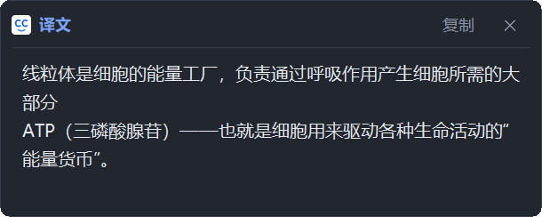
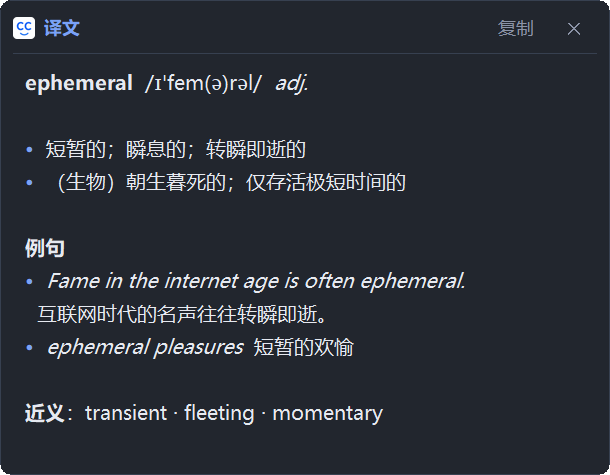
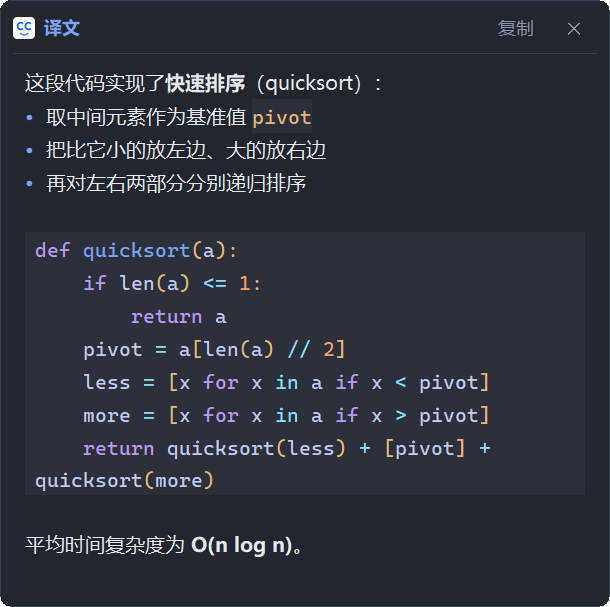
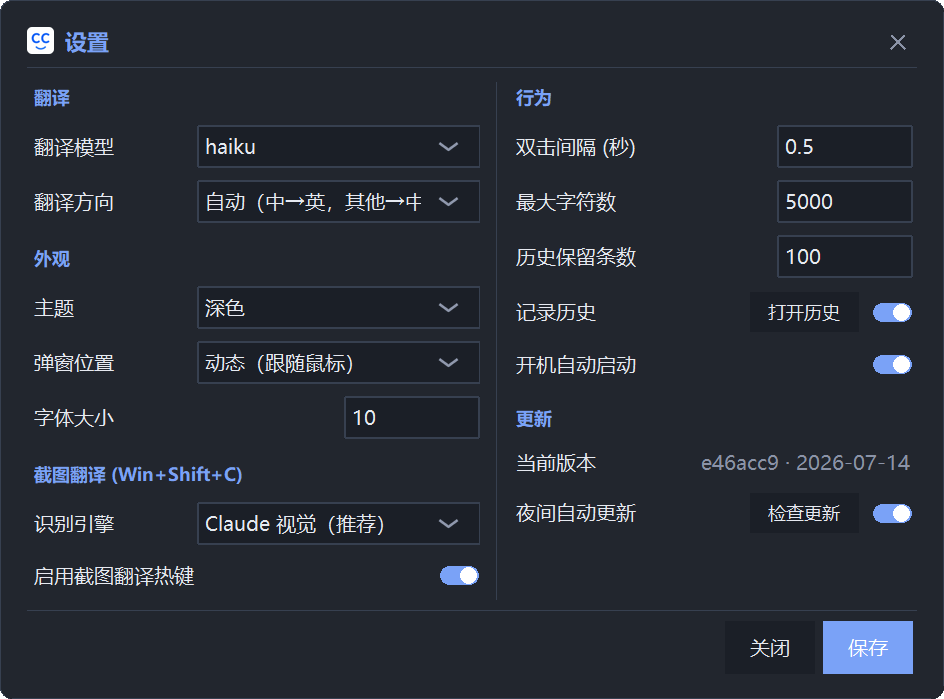
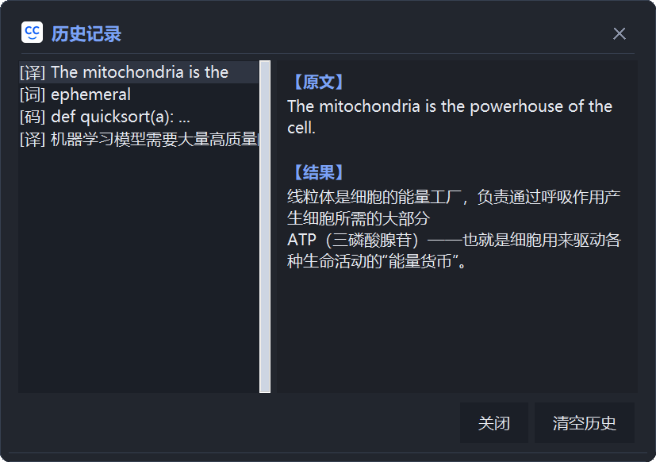

# CC Translate

[简体中文](README.md) | [English](README.en.md)

> ⚠️ **使用前必看（必需）**：CC Translate 必须有可用的 Claude 能力——要么已登录 Claude 订阅（Pro/Max），要么接入兼容的本地代理端点（例如 Agent Maestro）。两者都没有时，App 将无法工作。

这是一个由**大语言模型（LLM）驱动**、主打**高质量翻译**的本地划词翻译 App：**双击 Ctrl+C** 翻译当前选中的文字，弹窗显示译文。基于 Claude Code CLI，复用你已有的 Claude 能力，无需单独的 API key，全部本机运行。

## 界面预览

<p align="center">
  <br>
  <sub><b>双击 Ctrl+C</b> —— 选中文字，鼠标旁立刻弹出译文</sub>
</p>

<table>
<tr>
<td width="50%" valign="top" align="center">
  <br>
  <sub><b>词典模式</b>：选中单个单词，返回音标 / 词性 / 释义 / 例句</sub>
</td>
<td width="50%" valign="top" align="center">
  <br>
  <sub><b>代码解释模式</b>：选中代码不硬翻，用中文讲清它做什么</sub>
</td>
</tr>
<tr>
<td width="50%" valign="top" align="center">
  <br>
  <sub><b>设置</b>：两列布局，模型 / 方向 / 主题 / 截图翻译 / 更新一屏可见</sub>
</td>
<td width="50%" valign="top" align="center">
  <br>
  <sub><b>翻译历史</b>：托盘打开，左侧列表、右侧原文与结果</sub>
</td>
</tr>
</table>

## 功能

- **双击 Ctrl+C** 翻译剪贴板/选中文字，鼠标旁弹窗显示
- **代码解释模式**：选中的是代码时，不强行翻译，而是用中文解释代码用途；文字与代码混排时正常翻译并保留代码原样
- **词典模式**：选中单个单词时，返回中英双语词条（音标、词性、释义、例句）
- **富文本排版**：结果弹窗支持轻量 Markdown，并像代码编辑器一样对代码分色显示；复制出的仍是纯文本
- **多目标语言**：自动检测中↔英，或固定译成中/英/日/韩/法/德/西
- **弹窗内换向重译**：弹窗提供「重译」菜单，一键把选中内容重译成其他语言
- **长文流式**：长文本逐步显现译文
- **翻译历史**：托盘打开历史窗口
- **弹窗布局**：经典（屏幕居中）或动态（跟随鼠标），可在设置中切换
- **主题**：跟随系统 / 浅色 / 深色
- **系统托盘**：左键设置，右键历史/检查更新/暂停/退出
- **自动更新**：app 本身即 `git clone` 部署，可从 GitHub 检查并更新，支持手动「检查更新」与夜间自动更新
- 可设开机自启

## 运行环境

- Windows（用到 Windows API 做 DPI 感知、多屏定位、注册表读主题）
- Python 3.12+
- Node.js（用于安装 Claude Code CLI）
- 可用的 Claude 能力：已登录 Claude 订阅（Pro/Max），或兼容的本地代理端点（例如 Agent Maestro）
- ⚠️ **务必先把 Claude Code CLI 升级到最新版本**——旧版 CLI 的参数不兼容会导致翻译报错或结果异常，这是最常见的安装踩坑，装之前一定要更新到最新

## 快速安装（推荐）

在 **PowerShell** 里跑这一行，脚本会自动装好 git / Python / Node、拉取代码、安装 Claude CLI 与 Python 依赖，并启动程序：

```powershell
irm https://raw.githubusercontent.com/mclight-ship-it/cc-translate/master/install.ps1 | iex
```

它会自动完成**除登录 Claude 以外**的所有步骤——登录是一次性的浏览器授权，任何脚本都无法代劳。装完后按提示跑一次 `claude` 登录即可（用你现有的 Claude 订阅，不额外收费）。

> 可选环境变量（运行前设置）：`$env:CC_TRANSLATE_DIR` 指定安装目录（默认 `%USERPROFILE%\cc-translate`）；`$env:CC_TRANSLATE_DRYRUN="1"` 先“空跑”一遍，只显示每步会做什么、不做任何改动。

> 如果手动运行 `claude` 时报 **“running scripts is disabled on this system”**，是 PowerShell 默认执行策略（`Restricted`）挡住了 npm 的 `.ps1` 快捷方式。安装脚本会自动把当前用户策略设为 `RemoteSigned` 修复它；若仍遇到，手动执行 `Set-ExecutionPolicy -Scope CurrentUser RemoteSigned`（回答 Y），或改用 `claude.cmd` 登录。这不影响 app 翻译，但会挡住手动登录，而没登录就无法翻译。

想更透明地手动逐步安装，见下面的[安装（人工步骤）](#安装人工步骤)。

## 安装（人工步骤）

```bash
# 1. 获取项目代码
git clone https://github.com/mclight-ship-it/cc-translate.git
cd cc-translate

# 2. 安装 Node.js 和 Python（若已装可跳过）
winget install OpenJS.NodeJS.LTS
winget install Python.Python.3.12

# 3. 安装/升级 Claude Code CLI 并登录（走浏览器 OAuth，用你的订阅，不额外收费）
#    ⚠️ 即使之前装过，也务必跑这条升级到最新版——版本过旧会导致翻译失败或结果异常
npm install -g @anthropic-ai/claude-code@latest
claude --version   # 确认已是最新版；若明显偏旧，重跑上一行强制更新
claude   # 首次运行按提示在浏览器登录，然后 Ctrl+C 退出交互模式

# 4. 安装 Python 依赖
pip install pynput pyperclip pystray Pillow
# 可选：代码块语法高亮（缺失时自动降级为单色代码样式）
pip install Pygments

# 5. 首次运行（确保当前目录是项目根目录 cc-translate）
pythonw translator.pyw   # 首次运行会自动创建开始菜单里的“CC Translate”图标
```

> ⚠️ **务必更新到最新版 Claude Code CLI**：本工具依赖较新的 `claude -p` 命令行参数，
> 旧版会导致翻译报错或结果异常。**即使你之前已经装过 `claude`，安装本工具前也请再跑一次
> `npm install -g @anthropic-ai/claude-code@latest` 升级到最新版**，并用 `claude --version` 确认。

> 提示：`translator.pyw` 会自动探测 `claude` CLI 的位置（先查 PATH，再查 npm 全局目录）。
> 若找不到，请确保 `claude` 在 PATH 中，或 npm 全局 bin 目录已加入 PATH。

## 启动方式

首次运行后会自动在开始菜单创建 **CC Translate** 图标，后续可直接在开始菜单启动（无需命令行）。

## 开机自启（可选）

在应用的**设置**里勾选“开机自动启动”即可（会在启动文件夹创建快捷方式）。
或手动把 `run.vbs` 的快捷方式放进启动文件夹。`run.vbs` 依赖 `pythonw.exe` 在 PATH 中。

## 文件说明

| 文件 | 作用 |
|---|---|
| `translator.pyw` | 主程序 |
| `install.ps1` | 一行命令安装脚本（`irm ... \| iex`） |
| `run.vbs` | 静默启动器（可移植，定位同目录的 translator.pyw） |
| `cc-dark.ico` / `cc-light.ico` | 自适应托盘图标（深/浅色任务栏）；开始菜单/快捷方式用 `cc-dark.ico` |
| `cc.ico` | 旧版图标（图标缺失时的回退） |
| `config.json` | 用户配置（存于 `%APPDATA%\CC Translate\`，本地生成，不入库） |
| `history.json` | 翻译历史（存于 `%APPDATA%\CC Translate\`，本地生成，不入库） |

## 给 AI 助手的一键安装说明

见 [INSTALL_FOR_LLM.md](INSTALL_FOR_LLM.md)：把该文件内容交给新机器上的 Claude/AI 助手，它会按步骤完成依赖安装、登录、依赖库安装并启动。

## 开发 / 测试

改动流程与约定见 [AGENTS.md](AGENTS.md)。要点：

- 跑测试：`python -m unittest discover -s tests`（标准库，无需额外依赖）。
- 仓库自带 pre-push 钩子，推送前会自动跑测试、失败即阻止推送。
- **新 clone 后启用一次**：`git config core.hooksPath .githooks`。
