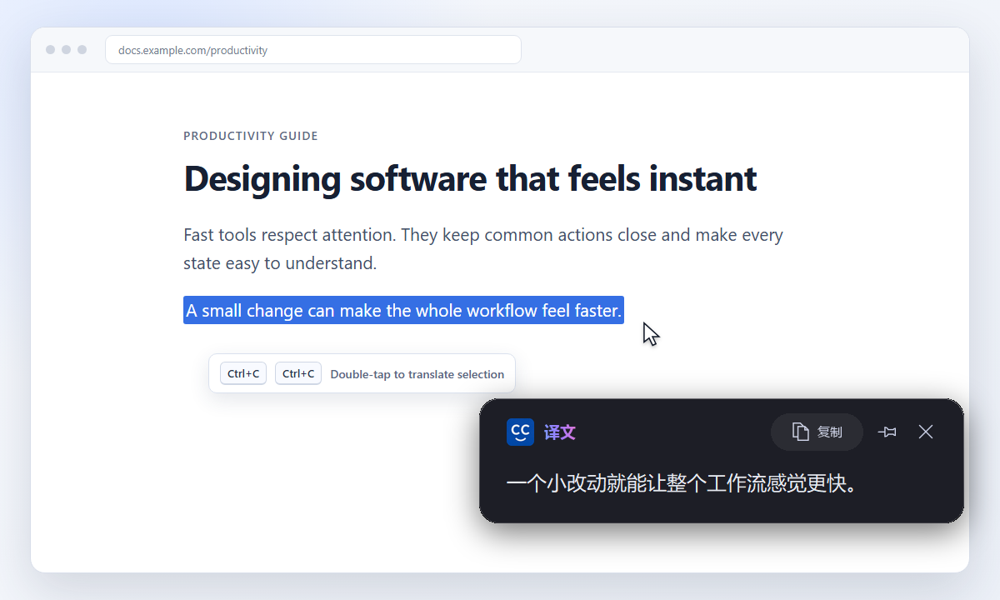
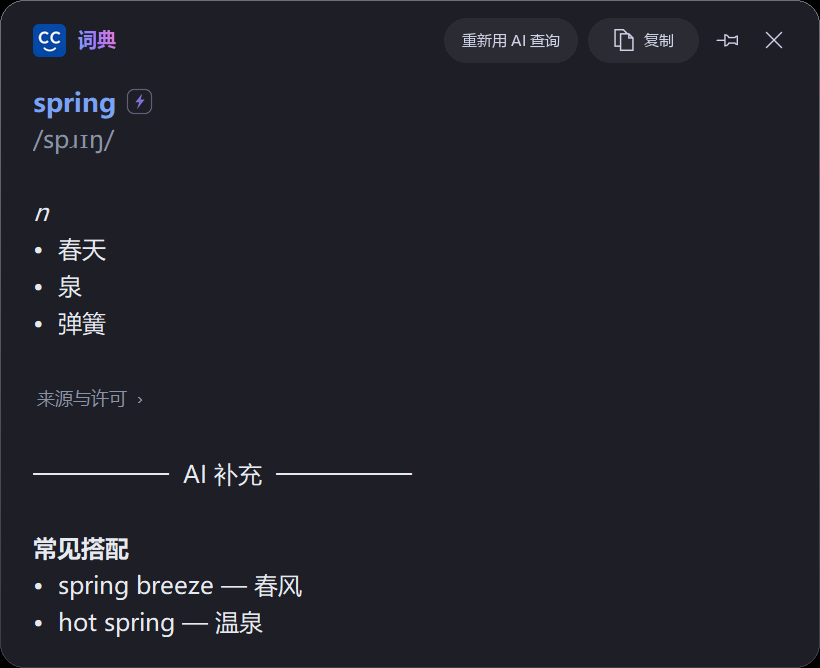
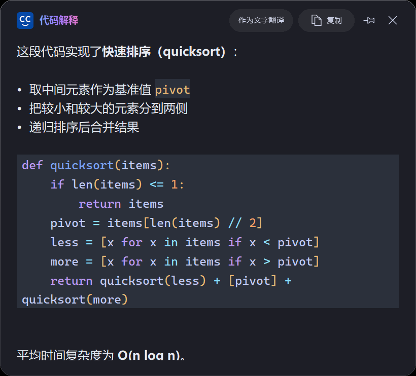
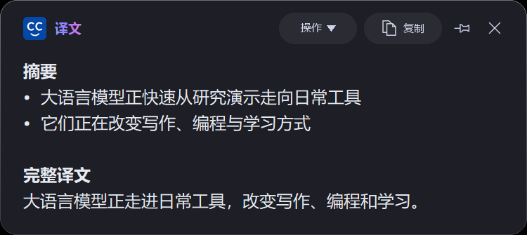
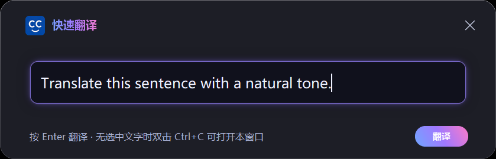
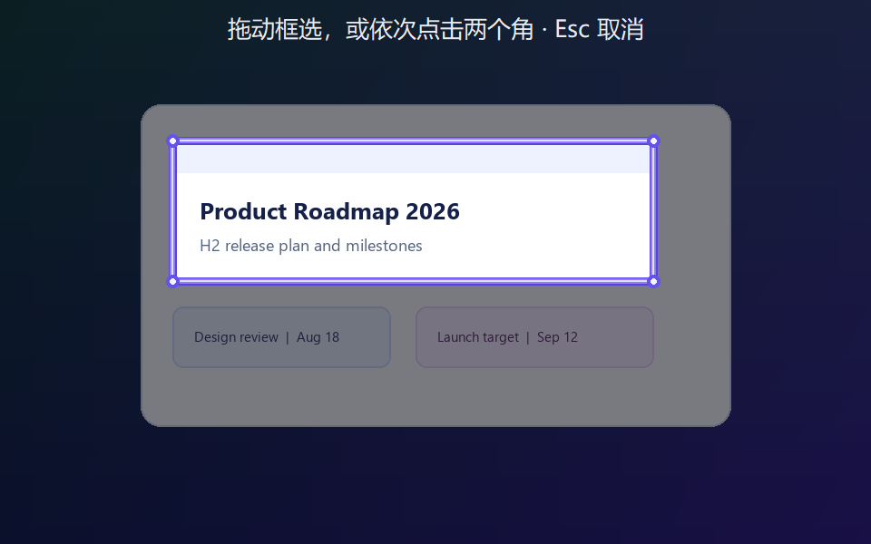
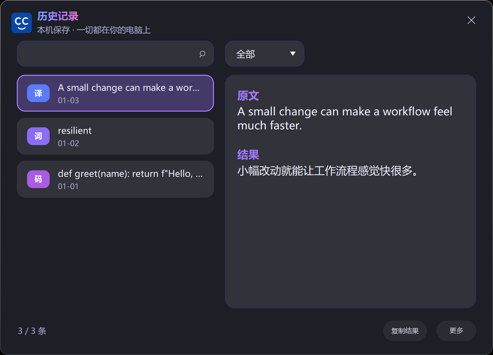

# CC Translate

[English](README.md) | [简体中文](README.zh.md)

> ⚠️ **Required before use:** CC Translate needs at least one working model CLI: the official Codex CLI signed in with ChatGPT, or Claude Code (subscription or compatible local proxy). OpenAI GPT smart routing is the default.

An **LLM-powered** select-and-translate app focused on **high-quality translation**: **double-tap Ctrl+C** to translate the currently selected text, shown in a popup near the cursor. It supports parallel Claude Code and OpenAI GPT (through the official Codex CLI) providers and needs no separate API key.

## Screenshots

<p align="center">
  <br>
  <sub><b>Double-tap Ctrl+C</b> — select text and the translation pops up next to your cursor</sub>
</p>

<table>
<tr>
<td width="50%" valign="top" align="center">
  <br>
  <sub><b>Dictionary mode</b>: a single word returns phonetics / part of speech / definitions / examples</sub>
</td>
<td width="50%" valign="top" align="center">
  <br>
  <sub><b>Code-explanation mode</b>: code isn't force-translated — it's explained in plain language</sub>
</td>
</tr>
<tr>
<td width="50%" valign="top" align="center">
  <br>
  <sub><b>Long-text summary (Beta)</b>: long text leads with a key-point summary, then the full translation</sub>
</td>
<td width="50%" valign="top" align="center">
  <br>
  <sub><b>Quick input translation</b>: with nothing selected, double-tap Ctrl+C to type text in an input box</sub>
</td>
</tr>
<tr>
<td width="50%" valign="top" align="center">
  <br>
  <sub><b>Screenshot translation</b>: press <code>Win+Shift+C</code> to drag-select any screen region and translate the text in it (vision model or offline local OCR)</sub>
</td>
<td width="50%" valign="top" align="center">
  <br>
  <sub><b>History</b>: opened from the tray — list on the left, source &amp; result on the right</sub>
</td>
</tr>
</table>

## Features

- **Double-tap Ctrl+C** to translate the clipboard/selected text, shown in a popup near the mouse
- **Claude / OpenAI GPT switching**: choose a model service in Settings. Claude keeps its existing warm pool and streaming path; GPT uses your local Codex CLI and ChatGPT sign-in.
- **Screenshot translation**: press `Win+Shift+C` to drag-select any screen region and translate the text in it; choose between the vision model or an offline local OCR engine
- **Quick input translation**: with nothing selected, double-tap Ctrl+C to open an input box and type the text you want translated
- **Code-explanation mode**: when the selection is code, it explains what the code does (in Chinese) instead of force-translating it; mixed prose + code is translated normally while the code is kept verbatim
- **Dictionary mode**: for a single selected word, returns a bilingual (CN/EN) entry (phonetics, part of speech, definitions, examples)
- **Long-text summary (Beta)**: when translating longer natural-language text, it leads with a short summary of the key points before the full translation
- **Rich-text rendering**: the result popup supports lightweight Markdown and colorizes code like a code editor; copied text stays plain
- **Multiple target languages**: auto-detect CN↔EN, or fix the target to Chinese/English/Japanese/Korean/French/German/Spanish
- **Re-translate/switch direction in the popup**: a "Re-translate" menu re-translates the selection into another language in one click
- **Rewrite & distill**: from the popup, rewrite the translation in a casual / formal / professional tone, or distill it to key points
- **Long-text streaming**: Claude progressively reveals long translations. Codex long-text app-server streaming is enabled by default as a Beta; it preserves source lists and emits summary points as Markdown bullets, preflights executable hooks before starting a model turn, and safely falls back to stable `codex exec` before output when necessary.
- **Provider-aware diagnostics**: the Diagnostics window shows Codex version/sign-in, streaming compatibility and trigger rules, the latest request route, and a seven-day app-run summary with outcomes, models, routes, and P50/P95. Its advisory rollout gate tracks the 7-day / 200-request target and streamed-first-text versus stable-long-text P95 without changing saved settings.
- **Smart selection detection**: automatically detects whether text is actually selected, so it won't mistranslate the whole field when nothing is selected in an input box (including cross-process apps like VS Code)
- **Translation history**: open the history window from the tray — searchable and filterable by type
- **Popup layout**: classic (screen-centered) or dynamic (follows the mouse), switchable in settings
- **Themes**: follow system / light / dark
- **System tray**: left-click runs a configurable action (default settings; also history / screenshot / quick translate); right-click for quick translate / screenshot translate / history / check for updates / pause / quit
- **Self-update**: the app itself is a `git clone` deployment, so it can check GitHub and update — via a manual "Check for updates" or a nightly auto-update
- Optional launch on startup

## Requirements

- Windows (uses Windows APIs for DPI awareness, multi-monitor positioning, and reading the theme from the registry)
- Python 3.12+
- Node.js (used to install the Claude Code and Codex CLIs)
- At least one provider:
  - Claude Code: a signed-in Claude subscription (Pro/Max), or a compatible local proxy endpoint (for example, Agent Maestro)
  - OpenAI GPT: the official Codex CLI signed in with ChatGPT
- ⚠️ **Upgrade the Claude Code CLI to the latest version first** — an outdated CLI has incompatible arguments that cause translation errors or garbled output. This is the most common install pitfall, so always update to the latest before installing.

## Quick install (recommended)

Run this one line in **PowerShell**. The script installs git / Python / Node as
needed, clones the repo, installs the Claude CLI, the compatible Codex CLI, and
Python dependencies, then launches the app:

```powershell
irm https://raw.githubusercontent.com/mclight-ship-it/cc-translate/master/install.ps1 | iex
```

It automates **everything except account sign-in** — Claude and Codex each use
a one-time browser OAuth flow that no script can complete for you. OpenAI GPT
is the default. Sign in to the official Codex CLI with:

```powershell
codex login
codex login status
```

CC Translate uses the CLI's cached ChatGPT sign-in but never reads or stores its
auth tokens. Claude remains available as an alternate provider in **Settings**.

For GPT, **Smart routing (fast)** is the default and streams text incrementally.
**Auto select (quality)** remains available when translation quality matters
more than latency. Model availability depends on your ChatGPT plan,
organization policy, and Codex CLI version.

> Optional environment variables (set before running): `$env:CC_TRANSLATE_DIR`
> to choose the install location (default `%USERPROFILE%\cc-translate`);
> `$env:CC_TRANSLATE_DRYRUN="1"` to do a dry run that only prints each step and
> changes nothing.

> If running `claude` manually fails with **"running scripts is disabled on this
> system"**, PowerShell's default `Restricted` execution policy is blocking npm's
> `.ps1` shims. The installer automatically raises the current-user policy to
> `RemoteSigned` to fix this; if you still hit it, run
> `Set-ExecutionPolicy -Scope CurrentUser RemoteSigned` (answer Y), or log in with
> `claude.cmd` instead. This does not affect the app's translation (it calls
> `claude.cmd` via subprocess, unaffected by the policy), but it blocks the manual
> login — and without logging in, translation can't work.

Prefer to install step by step? See [Install (manual steps)](#install-manual-steps) below.

## Install (manual steps)

```bash
# 1. Get the project code
git clone https://github.com/mclight-ship-it/cc-translate.git
cd cc-translate

# 2. Install Node.js and Python (skip if already installed)
winget install OpenJS.NodeJS.LTS
winget install Python.Python.3.12

# 3. Install/upgrade the Claude Code CLI and sign in
#    (browser OAuth, uses your subscription, no extra charge)
#    ⚠️ Even if you installed it before, run this to upgrade to the latest —
#       an outdated version causes translation failures or garbled output
npm install -g @anthropic-ai/claude-code@latest
claude --version   # confirm it's the latest; if clearly old, re-run the line above to force an update
claude   # on first run, follow the prompt to sign in via browser, then Ctrl+C to exit interactive mode

# Optional: install the GPT provider and sign in with ChatGPT
npm install -g @openai/codex@0.146.0
codex login
codex login status

# 4. Install Python dependencies
pip install pynput pyperclip pystray Pillow
# Optional enhancements (each feature auto-degrades/turns off if missing; core translation is unaffected):
pip install Pygments   # code-block syntax highlighting (falls back to monochrome code style when missing)
pip install winsdk     # offline local OCR engine (the vision model still works without it)
pip install comtypes   # smart selection detection, avoids mistranslating a whole input box when nothing is selected (incl. cross-process apps like VS Code)
# Or install everything at once (equivalent to all packages above): pip install -r requirements.txt

# 5. First run (make sure the current directory is the project root, cc-translate)
python -c "import cc_update,subprocess; subprocess.Popen([cc_update.ensure_branded_launcher() or cc_update.PYTHONW, cc_update.SCRIPT_PATH], cwd=cc_update.APP_DIR)"
```

> ⚠️ **Make sure the Claude Code CLI is up to date**: this tool relies on newer `claude -p`
> command-line arguments, and an old version causes translation errors or garbled output.
> **Even if you already had `claude` installed, run `npm install -g @anthropic-ai/claude-code@latest`
> again before installing this tool**, and confirm with `claude --version`.

> Note: `translator.pyw` auto-detects both CLIs, including their npm global
> installation directories. If one cannot be found, confirm its `.cmd` launcher
> is on PATH. The app invokes Codex with an ephemeral, read-only working
> directory and fails closed if Codex reports a tool event.

## Launching

The first run creates a small local branded launcher plus a **CC Translate**
icon in the Start Menu. The app still runs directly from this source checkout,
but Windows Task Manager shows **CC Translate** instead of the generic
**Python** process name. Afterwards, launch it straight from the Start Menu.

## Launch on startup (optional)

Check "Launch on startup" in the app's **Settings** (this creates a shortcut in the Startup folder).

## One-shot install instructions for AI assistants

See [INSTALL_FOR_LLM.md](docs/INSTALL_FOR_LLM.md): hand that file's contents to a Claude/AI assistant on a new machine and it will install the dependencies, sign in, install the libraries, and launch the app step by step.

## Development / testing

Change workflow and conventions are in [AGENTS.md](AGENTS.md). Key points:

- Run the tests: `python -m unittest discover -s tests` (standard library, no extra dependencies).
- The repo ships a pre-push hook that runs the tests before pushing and blocks the push on failure.
- **Enable it once after a fresh clone**: `git config core.hooksPath .githooks`.
