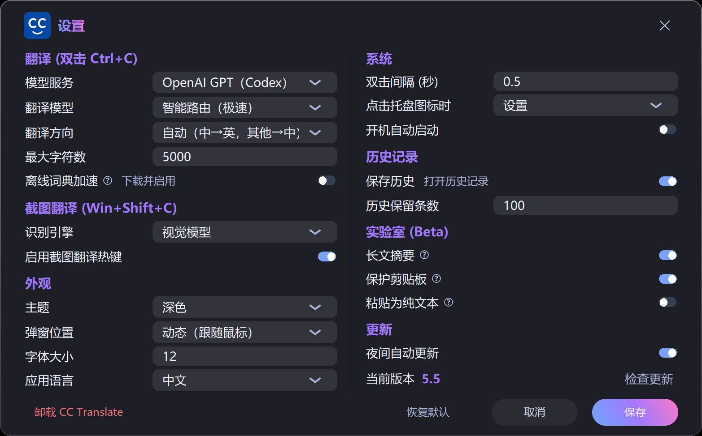

# CC Translate

[English](README.md) | [简体中文](README.zh.md)

**在 Windows 上双击 Ctrl+C，获得高质量划词翻译。**
译文直接出现在鼠标旁；可使用 OpenAI GPT 或 Claude，短词还可按需启用秒开的
中英离线词典。

> CC Translate 不要求单独申请自己的 API key，而是复用本机 Codex 或 Claude CLI
> 的认证。你仍需通过订阅/登录、API key 或兼容的自定义端点配置至少一个可用
> provider。

## 一条命令安装

在 **PowerShell** 中运行：

```powershell
irm https://raw.githubusercontent.com/mclight-ship-it/cc-translate/master/install.ps1 | iex
```

安装器会准备 Git、Python 3.12、Node.js、两套模型 CLI、Python 依赖和开始菜单
启动器；账号授权仍由 provider 自己完成。默认使用 OpenAI GPT，请运行：

```powershell
codex login
codex login status
```

如果你已经在 Codex 中配置好 API key 或兼容的自定义 provider，可以继续使用
原生配置，不必重新登录。若要使用 Claude，请运行 `claude` 完成浏览器登录，再到
设置中切换模型服务。

**运行要求：** Windows 10/11，并至少具备一个可用 provider：官方 Codex CLI
已完成 ChatGPT 登录、API-key 认证或配置了兼容的自定义 provider；或者最新
Claude Code CLI 已连接 Claude 订阅或兼容的本地代理。缺少 Git、Python 3.12、
Node.js 时，安装器会自动处理。

## 实际界面

<p align="center">
  <br>
  <sub>选中文字，双击 <b>Ctrl+C</b>，清晰的译文就出现在鼠标旁。</sub>
</p>

## 为什么用 CC Translate

- **一个手势，不打断工作。** 连按两次 `Ctrl+C` 翻译选中文字；没有选区时同一
  手势打开快速输入，`Win+Shift+C` 开始截图翻译。
- **调用模型前先在本地判断。** 本地分类器区分普通文字、代码和短词词典查询，
  不额外调用模型。代码会被解释而不是生硬翻译，文字与代码混排时保留代码原样。
- **离线词典先出结果，需要时再用 AI。** 可选词典只展示高置信精确命中，并带有
  闪电标识和来源；未命中无缝回退 AI，后台 AI 补充也不会拖慢本地首屏。
- **GPT 与 Claude 自由选择。** OpenAI GPT 通过官方 Codex CLI 接入，也可切换
  Claude Code。长文支持渐进显示，并可先给出简短要点摘要。
- **为日常反复使用而设计。** 本地可搜索历史、视觉模型或离线 OCR 截图翻译、
  改写与提炼、多目标语言、深浅主题、托盘控制和安全自更新。

<p align="center">
  <br>
  <sub>本地精确结果优先出现，来源数据与 AI 补充清楚分开。</sub>
</p>

<p align="center">
  <br>
  <sub><b>设置</b>：集中管理 provider、翻译、词典、截图、历史和更新。</sub>
</p>

<p align="center">
  <br>
  <sub><b>历史记录</b>：仅存本机，可搜索并按结果类型筛选。</sub>
</p>

## 日常使用

1. 从开始菜单启动 **CC Translate**，应用会常驻系统托盘。
2. 在任意应用里选中文字，双击 `Ctrl+C`。
3. 在结果弹窗中复制、换向重译、改写或提炼。
4. 按 `Win+Shift+C` 框选屏幕区域，用视觉模型或可选离线 OCR 翻译。
5. 从托盘打开设置，调整 provider、目标语言、主题、历史、词典和开机启动。

若自动分类不是你的本意，结果窗口始终保留手动纠正入口：可以把识别出的代码
“作为文字翻译”，也可以把普通文字“作为代码解释”。

## Provider、隐私与高级配置

CC Translate 只会把选中内容发送给你配置的 provider。Codex 请求采用临时会话、
stdin、只读沙箱、禁用 MCP/工具、hook 预检，并在遇到意外工具事件时失败关闭；
Claude 翻译调用同样禁用工具。应用不复制 provider 凭据，也不改写全局配置。

自定义 Codex provider、独立 `CODEX_HOME` 兼容模式、模型目录行为、手动安装、
可选 OCR 依赖与故障排查见[高级配置](docs/ADVANCED_CONFIGURATION.zh.md)。
若要交给编码助手安装，请使用
[INSTALL_FOR_LLM.md](docs/INSTALL_FOR_LLM.md)。

## 离线词典与许可证

约 65 MB 的可选词典只会在用户执行
**设置 → 离线词典加速 → 下载并启用**后下载；应用校验完成才原子安装，启动时
绝不自动抓取。关闭或删除本地词典后，AI 词典模式仍然可用。

词典制品包含以下固定版本数据：

- WikDict eng-zho 2025.11.21 — CC BY-SA 3.0
- CC-CEDICT 2017-04-28 immutable 快照 — CC BY-SA 3.0
- 通过 OMW 2.0 提供的 Chinese Open Wordnet / Princeton WordNet — 分别保留
  对应 WordNet 许可证
- Unihan 17.0.0 — Unicode License v3

应用代码与词典数据采用相互独立的许可条款。完整署名、上游 URL、hash、索引
修改和原始许可证文本见 [THIRD_PARTY_NOTICES](THIRD_PARTY_NOTICES)、
[`data/dictionary/licenses/`](data/dictionary/licenses/) 与
**关于 → 数据许可**；每条本地结果也可直接查看自己的来源。

本机已安装路径的 **12,000 次“本地查询 + 格式化”**基准 P95 为 0.616 ms；
该数字不代表从触发到弹窗显示的端到端耗时。

## 更多

- [高级配置与手动安装](docs/ADVANCED_CONFIGURATION.zh.md)
- [迭代路线图](docs/ROADMAP.md)
- [开发约定](AGENTS.md)

卸载时打开**设置**，滚动到底部并选择**卸载 CC Translate**。Python、Node.js
和模型 CLI 可能被其他应用使用，因此不会一并删除。
